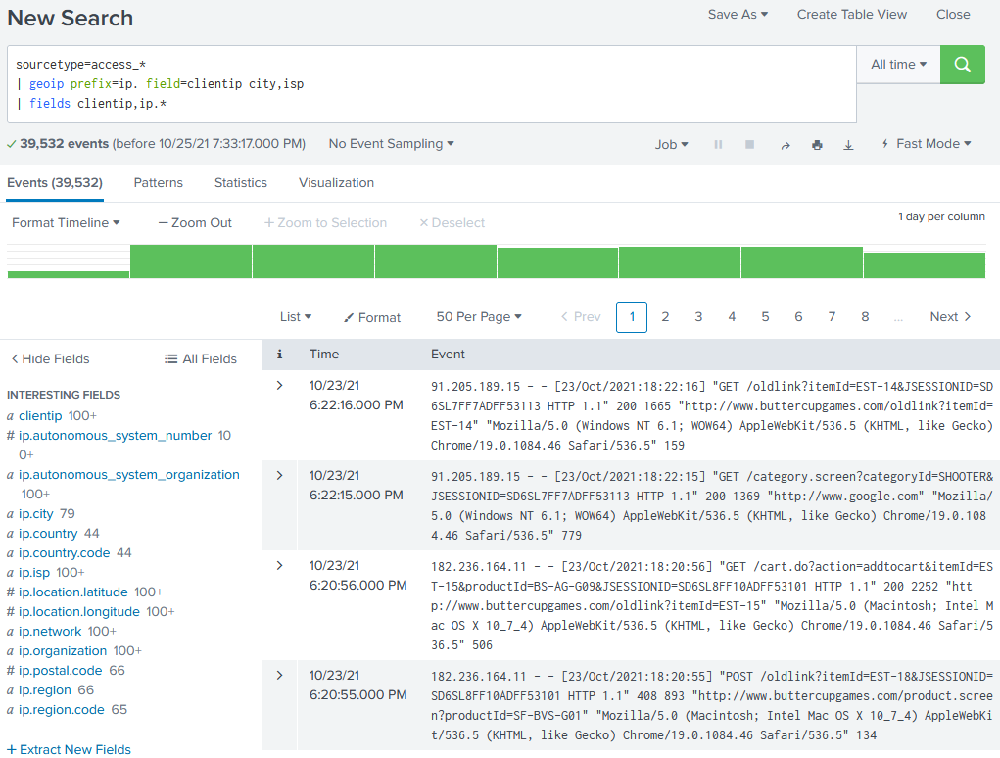
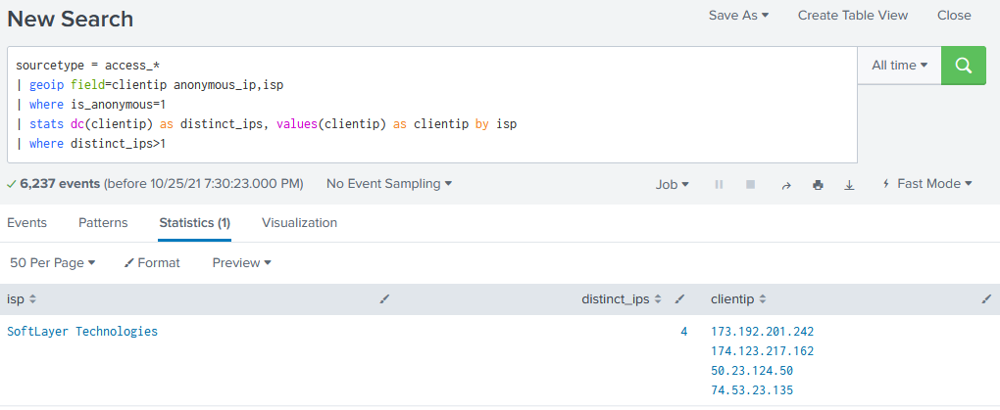

# geoip

## Description
Extracts location, service provider, domain, and hosting information from IP addresses by using MaxMind GeoIP2 databases. This command supports IPv4 and IPv6.

The IP address that you specify in the `ip-address-fieldname` argument, is looked up in the databases specified in `geoip-database`. Fields from those databases that contain relevant information are added to each event.

Because all the information might not be available for each IP address, an event can have empty field values.

For IP addresses which do not have a location, such as internal addresses, no fields are added. 

<br>

## Syntax
```
geoip [prefix=<string>] [fillnull=<string>] [field=<ip-address-fieldname>] <geoip-databases>
```

### Required arguments
None

### Optional Arguments

#### prefix
> **Syntax:** `prefix=<string>`<br>
> **Description:** Specify a string to prefix the field name. With this argument you can add a prefix to the added field names to avoid name collisions with existing fields. For example, if you specify `prefix=ip,` the field names that are added to the events become _ip.City, ip.County, ip.lat_, and so forth.<br>
> **Default:** NULL/empty string

<br>

#### fillnull
> **Syntax:** `fillnull=<string>`<br>
> **Description:** Specify a string to fill in null fields. With this argument you can add a string to all fields for a database query which did not return any results. For example, if you specify `fillnull="-"`, the fields will be filled with "-". This is necessary if you want to use the fields in a `<by-clause>` with [stats](https://docs.splunk.com/Documentation/Splunk/latest/SearchReference/Stats).<br>
> **Default:** NULL/empty string

<br>

#### field
> **Syntax:** `field=<ip-address-fieldname>`<br>
> **Description:** Specify an IP address field, such as `id.orig_h`.<br>
> **Default:** `ip`

<br>

#### geoip-databases
> **Syntax:** `((anonymous_ip | asn | city | connection_type | domain | isp)+ | all)`<br>
> **Description:** Specify the MaxMind GeoIP2 databases to search include details from. See the [database documentation](databases.md) for a list of attributes(fields) which are included from each database.<br>
> **Default:** `city`

<br>

## Usage
The `geoip` command is a distributable streaming command. See [Command types](http://docs.splunk.com/Documentation/Splunk/8.2.2/SearchReference/Commandsbytype). 

This application does not ship with any of the required databases.  They must be manually downloaded and added to the *data/databases* directory of this application.


<br>

## Examples
>These examples were adapted from the [Iplocation Examples](https://docs.splunk.com/Documentation/Splunk/8.2.2/SearchReference/Iplocation#Examples) within Splunk docs. The `geoip` command should function as an extension of the `iplocation` command.

### 1. Add location information to web access events
Add location information to web access events. By default, the `geoip` command adds the following fields from the _city_ database: `country`, `country.code`, `region`, `region.code`, `city`, `location.latitude`, `location,longitude`, `postal.code`, `network` to the results.
```
sourcetype=access_* | geoip field=clientip
```
### 2. Add a prefix to the fields added by the geoip command
Prefix the fields added by the `geoip` command with "**ip.**". Add all of the fields in the City and ISP database file to the results. 
```
sourcetype=access_* | geoip prefix=ip. field=clientip city,isp | fields clientip,ip.*
```


### 3. Search attributes from multiple databases
Identify Internet Service Providers (ISPs) with multiple anonymous IP addresses generating web access events.
```
sourcetype = access_* | geoip field=clientip anonymous_ip,isp | where is_anonymous=1 
| stats dc(clientip) as distinct_ips, values(clientip) as clientip by isp | where distinct_ips>1
```
